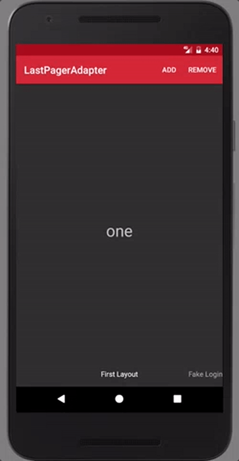

# :rocket: LastPagerAdapter

[](https://jitpack.io/#rakshakhegde/LastPagerAdapter)
[](https://gitter.im/LastPagerAdapter/Lobby?utm_source=badge&utm_medium=badge&utm_campaign=pr-badge&utm_content=badge)

**Ditch those long ViewPager Adapters you hate writing! - Android Library**

Based on [**Android Data Binding**](https://developer.android.com/topic/libraries/data-binding/index.html)

#### :kiss: Sweet and short library

Use the language of your choice.

```java
// Java
new LastPagerAdapter(BR.model)
    .add(R.layout.layout_one, "First Layout Title", modelObject1)
    .add(R.layout.layout_two, "Second Layout Title", modelObject2)
    .into(viewPager);
```
```kotlin
// Kotlin
viewpager.lastPagerAdapter(BR.model) {
    add(R.layout.layout_one, "First Layout Title", modelObject1)
    add(R.layout.layout_two, "Second Layout Title", modelObject2)
}
```
Download the [demo apk](https://github.com/rakshakhegde/LastPagerAdapter/raw/master/demo.apk) to play around with the LastPagerAdapter demo app.

</img>

         |  LastPagerAdapter
--------------------------|------------------------------------------------------------
:monorail: | Within a few lines easily hook up your data models with your ViewPager
:link: | Based on [**Android Data Binding**](https://developer.android.com/topic/libraries/data-binding/index.html)
:sparkles: | Written in [**Kotlin**](https://kotlinlang.org/). A conscise language you should definitely check out, if you haven't already.
:pencil2: | No need to write any PagerAdapter (FragmentPagerAdapter, etc.)
⾹ |  Doesn't rely on Fragments. It has complex lifecycle and best be avoided. [More reasons why](https://medium.com/square-corner-blog/advocating-against-android-fragments-81fd0b462c97#.k3lif924a)
:x: | No need to modify your existing model classes
:page_with_curl: | Supports different View layouts and hooking it up with ViewPager is a breeze
:ok_hand: | Super easy API. Concise syntax. Less Bugs for you to worry about. Boosted Productivity.
:memo: | Helpful error stacktraces
:rocket: | Very fast — no reflection
:iphone: | Minimum Android SDK: **Gingerbread API 9**

## :classical_building: Build

Add this in your root build.gradle at the end of repositories:
```gradle
allprojects {
    repositories {
        ...
        maven { url 'https://jitpack.io' }
    }
}
```
Step 2. Add the dependency in your module's gradle file
```gradle
// apply plugin: 'kotlin-kapt'  // this line only for Kotlin projects

android {
    ...
    dataBinding.enabled true
}

dependencies {
    compile 'com.github.rakshakhegde:LastPagerAdapter:1.0.0'
    // kapt 'com.android.databinding:compiler:GRADLE_PLUGIN_VERSION' // this line only for Kotlin projects
}
```

## :thinking: How to use

Create your View layouts with `<layout>` as root:

```xml
<layout xmlns:android="http://schemas.android.com/apk/res/android" >

    <data>
        <variable name="model" type="io.github.rakshakhegde.lastpageradaptersample.TextModel" />
    </data>

    <TextView
        android:layout_width="match_parent"
        android:layout_height="wrap_content"
        android:text="@{model.text}" />

</layout>
```

**It is important for all the item types to have the same variable name**, in this case "model".
This name is passed to the adapter builder as BR.variableName, in this case BR.model:

```java
// Java
new LastPagerAdapter(BR.model)
    .add(R.layout.text_layout, "Layout Title", textModelObject)
    .into(viewPager); // don't forget this line
```
```kotlin
// Kotlin
viewpager.lastPagerAdapter(BR.model) {
    add(R.layout.text_layout, "Layout Title", textModelObject)
}
```
And that is how easy it is. Download the [demo apk](https://github.com/rakshakhegde/LastPagerAdapter/raw/master/demo.apk) to play around with the LastPagerAdapter demo app.

## :sparkles: Acknowledgements

Library and API Structure inspired from [LastAdapter](https://github.com/nitrico/LastAdapter)

Library Concept inspired from SmartTabLayout's [Utils](https://github.com/ogaclejapan/SmartTabLayout/tree/master/utils-v4)

## :man_cartwheeling: Author
**Rakshak Hegde**

[Email](mailto:rakshakhegde@gmail.com) | [Twitter](https://twitter.com/rakshakhegde) | [Facebook](https://www.facebook.com/rakshakhegde) | [Google+](https://plus.google.com/+RakshakHegde) | [Linked.in](https://in.linkedin.com/in/rakshakrhegde)

<hr/>

Please suggest improvements and feel free to contribute.

:kiss: **K**eep **I**t **S**imple **S**illy


## :memo: License
```txt
Copyright 2016 Rakshak Hegde

Licensed under the Apache License, Version 2.0 (the "License");
you may not use this file except in compliance with the License.
You may obtain a copy of the License at

    http://www.apache.org/licenses/LICENSE-2.0

Unless required by applicable law or agreed to in writing, software
distributed under the License is distributed on an "AS IS" BASIS,
WITHOUT WARRANTIES OR CONDITIONS OF ANY KIND, either express or implied.
See the License for the specific language governing permissions and
limitations under the License.
```
